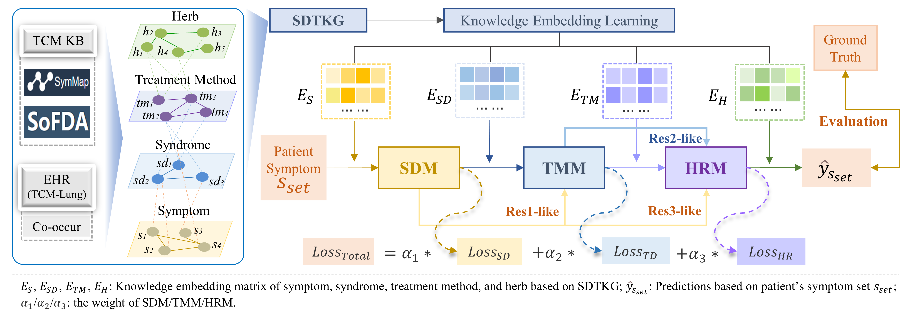

# PresRecST: A novel herbal prescription recommendation algorithm for real-world patients with integration of syndrome differentiation and treatment planning

## 1. Introduction
This repository contains source code and datasets for "[PresRecST: A novel herbal prescription recommendation algorithm
for real-world patients with integration of syndrome differentiation and treatment planning](https://doi.org/10.1093/jamia/ocae066)". 

In this study, we proposed a novel herbal **Pres**cription **Rec**ommendation network architecture for real-world patients with
integration of **S**yndrome differentiation and **T**reatment planning (termed PresRecST, See Fig1 below), following the basic diagnostic and
treatment process of real-world syndrome differentiation and treatment determination.

## 2. Overview



Fig1. Framework of PresRecST. The model takes the knowledge embedding matrices of SDTKG and the patient’s symptom set as
input, and combines them with the residual-like neural network for recommending syndromes(SDM), treatment methods(TMM) and
herbs(HRM) progressively.

## 3. Install Python libraries needed
```bash
$ conda create -n presrecst_env python=3.6
$ conda activate presrecst_env
$ pip install -r requirements.txt
```

## 4. Basic Usage
### (1) dataset
The relevant data required by the model are uniformly placed in the "data" folder. This folder contains the following two data files:
<li><b>prescript_1195.csv</b>: This dataset is derived from the work of [Yao et al., TKDE 2018], consisting of 33,765 entries after processing (termed TCM-PD in this study). This dataset was utilized for subsequent research on TCM prescription recommendation.
<li><b>TCM_Lung.xlsx</b>: This dataset was constructed in this study and originates from the First Affiliated Hospital of Henan University of Chinese Medicine (FAH-HUCM). 
It focuses on pulmonary diseases and comprises 14,948 entries after processing. Considering the clinical nature of the data, despite de-identification efforts, its clinical characteristics were still taken into account. Therefore, only 4,484 entries are made publicly available in this project. 
Each entry includes symptoms, syndromes, therapeutic methods, and TCM prescriptions in the form of IDs, along with a mapping table providing the corresponding names for these IDs. 

**To ensure data security, we have encoded the TCM-Lung dataset (i.e., each symptom/syndrome/treatment method/herb has been converted into an ID). If you require the full names for research purposes, please contact us via email: <a>x_dong@bjtu.edu.cn</a>.**

### (2) main code
The python script file of the model is shown in this project, including the following files:
<li><b>main_Lung.py</b>: Run the entire program (based on the TCM-Lung dataset)
<li><b>main_TCMPD.py</b>: Run the entire program (based on the TCM-PD dataset)
<li><b>dataloader.py</b>: Data loading functions, including loading for both datasets
<li><b>model.py</b>: Model-related programs, including models applicable to both datasets
<li><b>tools.py</b>: Some related utility functions
<li><b>training_and_testing.py</b>: Training and testing-related programs

### (3) result

After running the "main_Lung.py" or "main_TCMPD.py" file, the Top@K performance results of the model on the testing set can be obtained. 
The result file is placed in the "result" folder, that is, the "Evaluation.xlsx" file. 
The result file contains four columns: 
<li>the "k" column represents the number of k in Top@k (k ranges from 1 to 20 in the results)</li>
<li>the "Precision" column represents the precision@k</li>
<li>the "Recall" column represents the recall@k</li> 
<li>the "F1_score" column represents the F1 score@k</li>


## 5. Citation and Contact

If you find PresRecST useful for your research, please consider citing the following paper:

Dong X, Zhao C, Song X, Zhang L, Liu Y, Wu J, Xu Y, Xu N, Liu J, Yu H, Yang K, Zhou X. PresRecST: a novel herbal prescription recommendation algorithm for real-world patients with integration of syndrome differentiation and treatment planning[J]. Journal of the American Medical Informatics Association, 2024, 31(6): 1268-1279.

```
@article{dong2024presrecst,
  title={PresRecST: a novel herbal prescription recommendation algorithm for real-world patients with integration of syndrome differentiation and treatment planning},
  author={Dong, Xin and Zhao, Chenxi and Song, Xinpeng and Zhang, Lei and Liu, Yu and Wu, Jun and Xu, Yiran and Xu, Ning and Liu, Jialing and Yu, Haibin and others},
  journal={Journal of the American Medical Informatics Association},
  volume={31},
  number={6},
  pages={1268--1279},
  year={2024},
  publisher={Oxford University Press}
}
```

<b>If you have better suggestions or questions about our work, please contact us: <a>x_dong@bjtu.edu.cn</a>. </b> 

<b>Welcome to follow our project on GitHub: <a>https://github.com/2020MEAI </a> and <a> https://github.com/xdong97 </a>. </b>

