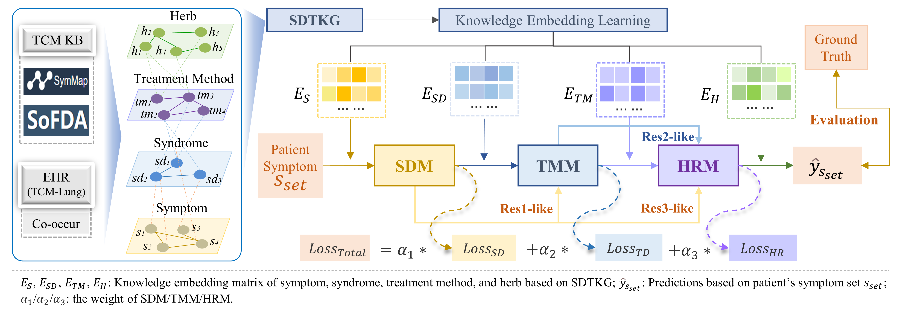

# STHNet
This repository is the project of STHNet.

### Overview



### Requirements

- Python 3.6.5
- PyTorch 1.6.0

### Usage

```
python main.py
```
### Data Availability

Due to the sensitive nature of TCM medical data, we have encrypted the currently TCM-Lung dataset. Please contact x_dong@bjtu.edu.cn to obtain the decryption password.
